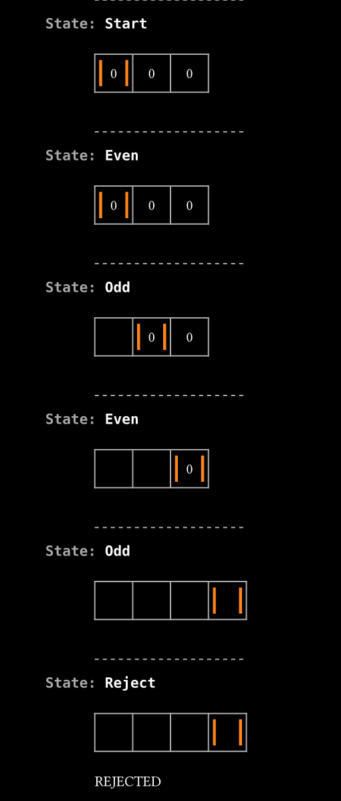

# The Turing Machine in Typst

You all know that Typst is Turing-complete, right? 
Well, I wrote an actual Turing Machine!

### But why?

Well, I had a lab in University with task to write several programs in TM language. 
And all the interpreters I found on internet are quite slow or have an inconvenient interface,
so I decided to write one myself.
And, when something needs visualization, Typst is the first that comes to my head.
And here we are... 

Huge thanks goes out to [@sitandr](https://github.com/sitandr), who helped very much with the layout look and performance!

### OK, show me

You're welcome! Here's a simple program that accepts an even number of zeroes, and rejects an odd one:

```
Start 0 -> Even 0 ^
Even _ -> Accept _ ^
Even 0 -> Odd _ >
Odd 0 -> Even _ >
Odd _ -> Reject _ ^
```

Here `Start`, `Accept` and `Reject` are predefined states. `_` means an empty cell, `<`, `>`, `^` mean "go left", "go right" and "stay" respectively.

Starting with `Even`, the machine alternates its state every step. If it sees an empty cell, it considers the input to be ended, 
and changes to accepting state if `Even`, or to rejecting state if `Odd`.

And here's the visualization, with `000` given as input:



### How do I use it?

There are three functions you need to know about, all described in the `turing.typ` file.

+ `parse-code` &mdash; exactly what it says on the package, parses the code. 
 It accepts a string or a code block, and returns the internal representation of the automaton.

+ `run` &mdash; runs the code until the machine accepts the result, rejects it, breaks, or reaches the timelimit. 
It accepts the initial state (which is an array of tapes, where tape is an array of symbols, where symbol is a string), and the rules.
The rules should be something that `parse-code` returns.
You can also specify custom starting, accepting and rejecting state names. 
Returns the pair of the `data` and the ending state. 
The ending state is `none` if the machine broke, or the last state machine was in, otherwise. 
Note that if machine broke, there is still data about its evaluation

+ `trace` &mdash; displays the evaluation process. Accepts the data received from `run`, and the last state. You can also specify the `break-every` parameter to insert a pagebreak after each couple of state changes.

All the above also support multi-taped Turing Machines, 
see `postfixlogic` for the syntax and the logic behind using it.

So, regularly the usage is as follows:

```typ
#let rules = parse-code(read("postfixlogic.tm"))

#let initial-state = (to-arr("01|0&1|"), to-arr("_"))

#let (data, endstate) = run(initial-state, rules, lim-steps: 1000)

#trace(data, endstate, break-every: 10)
```

`to-arr` is a util function which turns a string into array of chars.

### What are those other files? 

They are examples of code (`.tm` files) and its evaulation on sample inputs (`.pdf` files).

Unless otherwise stated, all the numbers are in binary format.

+ `aplusb`

Adds two numbers, separated by `+`. For example, it turns `10+11` into `101`.

+ `balanced`

Checks if the input contains only parentheses which are correctly matched. For example, it accepts `(()())` and rejects `())(`.

+ `convertto2`

Converts a number from a ternary form to a binary form. 
For example, it turns `102` (ternary for eleven) into `1011`.

+ `less`

Compares two numbers separated by `<`. For example, it rejects `11<10`

+ `mirror`

Appends a reversed number to itself. For example, it turns `10100` into `1010000101`.

+ `tandem`

Checks if a number string consists of two repeating words. For example, it accepts  `110110`.

+ `factorial`

This is where I got bored writing for TM with only one tape, so I hardcoded all the factorials from 0! to 30! in base-32 system, and then wrote turning base-32 to binary. It passed all the tests, by the way.

+ `postfixlogic`

And there come multitaped machines. 
This one uses a second tape as a stack for evaluating an expression written in Polish notation. For example, it evaluates `01|0&1|` to `1`.

Don't forget to pass extra empty tapes to the `run` function!

+ `infixlogic`

And more of it, this time there is a usual infix notation: `(0|0|1)&1&0` should be evalutated to 0. This almost is the idea of two-stack machine, and the evaluation is divided into three phases: first it eliminates `&`s, then `|`, and then parentheses. 
And repeats if there's something left.

+ `sorting`

Yeah, right. It uses the bubble sort, not the in-place merge sort, sorry for that. Yet it anyway required four tapes and countless efforts to avoid getting confused.

